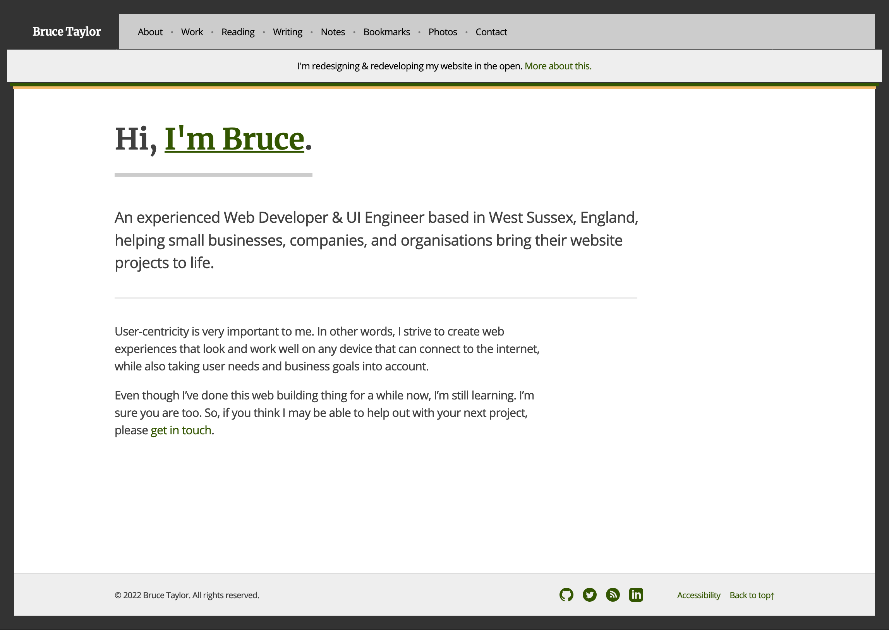

[![1x-badge](https://img.shields.io/github/stars/cutenode/1x.engineer.svg?color=purple&label=1x%20Engineers&logo=image%2Fpng%3Bbase64%2CiVBORw0KGgoAAAANSUhEUgAAADAAAAAwCAYAAABXAvmHAAADAElEQVRoQ%2B1YPZMNQRQ9RyYiUCVkI0J%2BASUi4xfYzYjsVsmXX2BFZFauigyJ4hcQEtkNVQmoEjvqqh7VM6%2B%2FZ%2BapqXodvtdz%2B56%2B59zT3cTCBxeePzYA%2FncFNxUoqYCkEwC2AbwjeVTyTemctVRA0iUAH11SxwBekLxfmmRq3roA3AHwxEvkLcnrSwJwCOC2l%2FBDkg%2BWBOAzgAtewjdIvlkEAElnAHwDYEK28RvAWZLflwLAuP7aS%2FYLyYtTJG8xZhexJOP6vpfwc5LWUicZ6wDwHsAVL9u7JJ9Okv2YCki6SfJVKhFnYL8AnPTmXSb5yf%2BuJFZsnaYKSHoEYBfAIcmdWPCBgdk0E64J2IT8d0h65lz6gORebWWqAEg6DeAlgKveQjskrc%2BvDElJA5NkWjAA3TC63SL5oxRIMQC3m5b8%2BUHwn%2FZbaFFJUQNzm2HnolODePabgejRbBSF3E4ZbawC%2FrBzjWkhuJikpIG5TTEdnRvEtQrsxSrrz81WwOP7cBM%2BuOSD5S41MFcJA%2BF3qm6trC6iACJ87wI%2FJmkijg5JVQYm6QDAvUDApC6CADJ83y0pbYuBOaoakGJdrACwnuw6QxXfhzsnqcnAMrqwjtfznhCAr4FOk%2BR7IHk7uGUNLMa%2FhC6OSG4lRSzJ2tiwK1T15xIDy%2Bgn5Df2yTHJXhuPUcj6dzEPAxVovoFl9LedpZAlM7Y%2Fpwwss%2FPmzFV%2Bk2ujTf05Z2AhEK1%2BU2JkVf251MA6EGP9JgvAUcpKW9SfawxsCr8pAlCgi63uMFdqYG7nrWWP8ptiAA6ELTbURe84XWNggeN0ld9YTlUAPN52uujdb0tvYL6IvY6VPV%2BFxN8EwFVj5UrZamBrv1ImjgDNBpbyh9R%2FzRWI9PLZnhBjIKYGMNsT4uwAag2slTLD7yarQI2BTZV8cxuN8H%2FWJ8R1UKjpBja2GlNSyMzNrqPdZWjlCXFsspMaWcIL7MZ0zT07%2FntCnCP5STUwV4K5uJNRKLfQXP9vAMy1s6VxF1%2BBPxWSokDSvlDHAAAAAElFTkSuQmCC&style=for-the-badge)](https://1x.engineer) [](https://stackblitz.com/github/brootaylor/brootaylor-v2)

# Monorepo of brootaylor.com *(v2)* [](https://app.netlify.com/sites/brootaylorv2/deploys)

brootaylor.com is a monorepo using [Workspaces](https://docs.npmjs.com/cli/v8/using-npm/workspaces).

That's kinda weird in some ways I guess &mdash; but I've done it this way *(for now)* so I can have multiple sites / applications using common dependencies wherever possible.

At the moment it allows me to build an [Eleventy version](https://github.com/brootaylor/brootaylor-v2/tree/main/sites/eleventy) as well as an [Astro version](https://github.com/brootaylor/brootaylor-v2/tree/main/sites/astro) of my website. Well, while I'm messing around with Astro anyhow.

---

Now, I say this gingerly - but I'd be honoured if anyone wanted to contribute any thoughts and pearls of wisdom. All I ask is you be kind. If there's anything you spot that seems dodgy or if you'd like to recommend an enhancement, (and you have the time), you're more than welcome to [summit a GitHub issue](https://github.com/brootaylor/brootaylor-v2/issues).



## Getting setup

Instructions for cloning and installing.

```bash
# Clone this repository
git clone git@github.com:brootaylor/brootaylor-v2.git

# Go to the working directory
cd brootaylor-v2

# Install dependencies
npm install
```

## Netlify CI & CD setup

Instructions for installing, creating a [*new Netlify instance*], or linking a local dev instance to an existing remote Netlify site instance.

```bash
# Install the Netlify CLI globally
npm i -g netlify-cli

# Set up the deployment rules => (follow the instructions in this process)
netlify init

# Deploy to Netlify
netlify deploy
```

## Useful Netlify commands

Here are some other Netlify commands that can often be useful.

```bash
# Opens current site admin UI in Netlify
netlify open:admin

# Opens current site url in default browser
netlify open:site

# Handle various site operations
netlify sites

# Prints status info about the current Netlify user and site
netlify status

# Create a new deploy from the `dist` folder (creates a draft URL)
netlify deploy

# Manage netlify functions
# Ref: https://www.netlify.com/tags/functions/
netlify functions

# list installed plugins
# Ref: https://www.netlify.com/tags/plugins/
netlify plugins

# Link local repo or project folder (ie. `dist`) to an existing site on Netlify
netlify link

# Unlink local folder (ie. `dist`) from a Netlify site
netlify unlink
```
