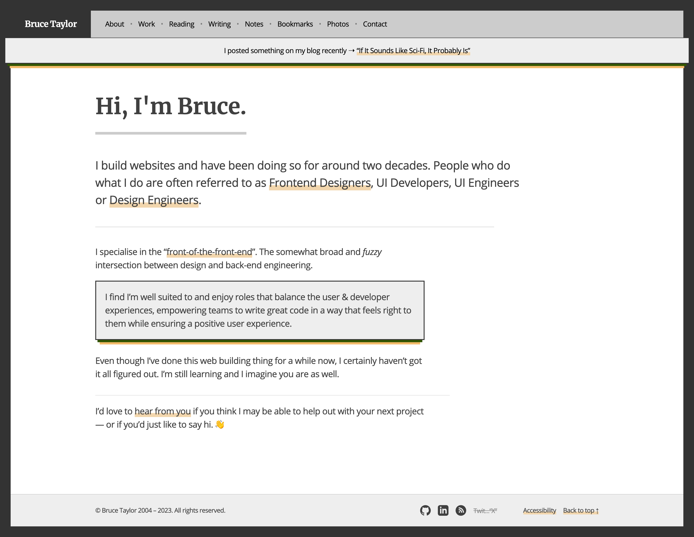

# Monorepo of brootaylor.com

brootaylor.com is a monorepo using [Workspaces](https://docs.npmjs.com/cli/v8/using-npm/workspaces).

That's kinda weird in some ways I guess but I've done it this way *(for now)* so I can have multiple sites / applications using common dependencies wherever possible.

At the moment it allows me to build a *version* of my website using [Eleventy](https://github.com/brootaylor/brootaylor-v2/tree/main/sites/eleventy) as well as another *version* using [Astro](https://github.com/brootaylor/brootaylor-v2/tree/main/sites/astro). Well, while I'm messing around with Astro anyhow.

